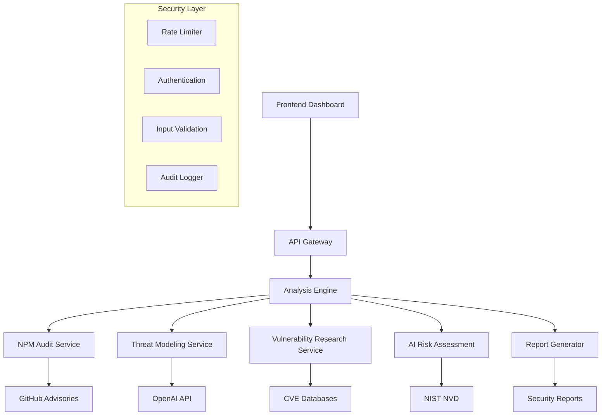

# 🛡️ Vuln Risk Agent - AI-Powered Vulnerability Assessment

[](https://github.com/Thebul500/vuln-risk-agent)
[](https://github.com/Thebul500/vuln-risk-agent/actions)
[](https://github.com/Thebul500/vuln-risk-agent/security/code-scanning)
[](https://hub.docker.com/r/thebul500/vuln-risk-agent)

A production-ready, enterprise-grade web-based tool that performs comprehensive security analysis on Node.js repositories, providing AI-powered threat modeling and vulnerability assessments with intelligent risk prioritization.


## 🚀 **Key Features**

### 🔍 **Advanced Security Analysis**
- **AI-Powered Risk Assessment** - Context-aware vulnerability analysis using OpenAI
- **Intelligent Triage** - Automated false-positive detection and filtering
- **Threat Modeling** - Comprehensive threat model generation
- **Supply Chain Security** - Deep dependency analysis with CVE correlation

### 📊 **Enterprise Dashboard**
- **Interactive Visualizations** - Real-time charts and vulnerability metrics
- **Risk Prioritization** - Business context-aware severity scoring
- **Trend Analysis** - Historical vulnerability tracking and reporting
- **Export Capabilities** - PDF, JSON, and CSV report generation

### 🛡️ **Security-First Architecture**
- **Zero-Trust Design** - Comprehensive input validation and sanitization
- **Rate Limiting** - DDoS protection and resource management
- **Security Headers** - OWASP-compliant HTTP security headers
- **Audit Logging** - Complete security event tracking

### 🔄 **DevSecOps Integration**
- **CI/CD Ready** - GitHub Actions with automated security gates
- **Container Security** - Multi-stage Docker builds with security scanning
- **Automated Testing** - Comprehensive test suite with security focus
- **Dependency Monitoring** - Automated vulnerability detection and updates

## 🏗️ **Architecture Overview**



## 🚀 **Quick Start**

### **Prerequisites**
- Node.js 18+ and npm
- Docker and Docker Compose
- GitHub Personal Access Token
- OpenAI API Key

### **Environment Setup**

1. **Clone the repository**
   ```bash
   git clone https://github.com/Thebul500/vuln-risk-agent.git
   cd vuln-risk-agent
   ```

2. **Configure environment variables**
   ```bash
   cp agent/.env.example agent/.env
   # Edit agent/.env with your API keys
   ```

3. **Required Environment Variables**
   ```bash
   # Security Configuration
   GITHUB_TOKEN=your_github_personal_access_token
   OPENAI_API_KEY=your_openai_api_key

   # Server Configuration
   PORT=4000
   NODE_ENV=production
   CORS_ORIGIN=http://localhost:8080

   # Security Settings
   RATE_LIMIT_WINDOW_MS=900000
   RATE_LIMIT_MAX_REQUESTS=100
   ```

### **Development Mode**

```bash
# Install dependencies
cd agent && npm install
cd ../frontend && npm install

# Start development servers
cd agent && npm run dev     # Backend on port 4000
cd frontend && npm start    # Frontend on port 8080
```

### **Production Deployment**

```bash
# Using Docker Compose (Recommended)
docker-compose up -d

# Or build and run manually
docker build -t vuln-risk-agent ./agent
docker build -t vuln-risk-frontend ./frontend
docker run -d -p 4000:4000 --env-file agent/.env vuln-risk-agent
docker run -d -p 8080:8080 vuln-risk-frontend
```

## 📡 **API Documentation**

### **Primary Endpoints**

#### `POST /analyze`
Performs comprehensive security analysis on a GitHub repository.

**Request:**
```json
{
  \"githubUrl\": \"https://github.com/owner/repository\",
  \"options\": {
    \"includeDevDependencies\": true,
    \"generateThreatModel\": true
  }
}
```

**Response:**
```json
{
  \"success\": true,
  \"repository\": \"https://github.com/owner/repository\",
  \"analysisTime\": \"45.2s\",
  \"vulnerabilities\": {
    \"critical\": 2,
    \"high\": 5,
    \"medium\": 12,
    \"low\": 8,
    \"details\": [...]
  },
  \"threatModel\": \"# Threat Model\\n...\",
  \"metadata\": {
    \"analysisVersion\": \"2.0.0\",
    \"toolsUsed\": [\"npm-audit\", \"github-advisories\", \"threat-modeling\", \"openai-analysis\"]
  }
}
```

#### `GET /health`
Health check endpoint for monitoring and load balancers.

#### `GET /api-docs`
Complete API documentation and endpoint reference.

## 🧪 **Testing**

### **Run Test Suite**
```bash
cd agent
npm test                 # Unit tests
npm run test:coverage    # Coverage report
npm run test:watch       # Watch mode
npm run lint             # Code quality
npm run security-check   # Security audit
```

### **Integration Testing**
```bash
docker-compose -f docker-compose.test.yml up
npm run test:integration
```

## 🔒 **Security Features**

### **Built-in Security Controls**
- ✅ **Input Validation** - Comprehensive request sanitization
- ✅ **Rate Limiting** - Configurable request throttling
- ✅ **CORS Protection** - Strict origin validation
- ✅ **Security Headers** - OWASP-compliant HTTP headers
- ✅ **Error Sanitization** - No sensitive data in error responses
- ✅ **Audit Logging** - Complete security event tracking

### **Container Security**
- ✅ **Non-root User** - Containers run as unprivileged user
- ✅ **Multi-stage Builds** - Minimal production image
- ✅ **Security Scanning** - Automated vulnerability detection
- ✅ **Resource Limits** - Memory and CPU constraints

### **Supply Chain Security**
- ✅ **Dependency Scanning** - Automated vulnerability monitoring
- ✅ **SBOM Generation** - Software Bill of Materials
- ✅ **License Compliance** - Open source license validation
- ✅ **Signature Verification** - Package integrity validation

## 📈 **Performance & Scalability**

### **Performance Metrics**
- **Analysis Speed**: ~30-60 seconds per repository
- **Concurrent Analyses**: Up to 3 simultaneous scans
- **Memory Usage**: <512MB per analysis
- **API Response Time**: <100ms for health checks

### **Scaling Options**
- **Horizontal Scaling**: Multiple container instances
- **Load Balancing**: Nginx or cloud load balancer
- **Caching**: Redis for vulnerability data caching
- **Queue Management**: Analysis job queuing for high load

## 🤖 **Automated Enhancement**

This project features an **AI-powered enhancement system** that automatically:
- 📅 **Biweekly Feature Planning** - Intelligent roadmap prioritization
- 🔄 **Automated Issue Creation** - GitHub issues with detailed implementation plans
- 🛠️ **Code Generation** - Starter templates for new features
- 📊 **Progress Tracking** - Automated project management
- 🚀 **Quality Gates** - Automated testing and security validation

**Enhancement Categories:**
- **Security & Intelligence** - Threat feeds, SAST integration, supply chain security
- **Features & Integrations** - Dashboard improvements, multi-language support, API integrations
- **Infrastructure & DevOps** - Kubernetes deployment, performance optimization, enterprise auth

## 🤝 **Contributing**

### **Development Workflow**
1. Fork the repository
2. Create a feature branch (`git checkout -b feature/amazing-feature`)
3. Commit changes (`git commit -m 'Add amazing feature'`)
4. Push to branch (`git push origin feature/amazing-feature`)
5. Open a Pull Request

### **Code Standards**
- **ESLint** - JavaScript/Node.js linting
- **Security Focus** - All code reviewed for security implications
- **Test Coverage** - Minimum 80% test coverage required
- **Documentation** - Comprehensive inline and API documentation

### **Security Contributions**
- Report security issues privately to security@bul-network.com
- Include detailed reproduction steps
- Allow reasonable time for patch development
- Follow responsible disclosure guidelines

## 📋 **Roadmap**

### **Q1 2025 - Security & Intelligence**
- [ ] Real-time CVE monitoring integration
- [ ] SAST (Static Application Security Testing) integration
- [ ] Enhanced supply chain security analysis
- [ ] Advanced threat intelligence feeds

### **Q2 2025 - Platform Expansion**
- [ ] Multi-language support (Python, Go, Java, .NET)
- [ ] Advanced reporting dashboard with charts
- [ ] API integrations (Slack, Jira, SIEM tools)
- [ ] AI-powered risk prioritization enhancements

### **Q3 2025 - Enterprise Features**
- [ ] Kubernetes deployment and Helm charts
- [ ] Performance optimization and caching
- [ ] Enterprise authentication (SSO, RBAC)
- [ ] Advanced analytics and trend analysis

## 📜 **License**

This project is licensed under the MIT License - see the [LICENSE](LICENSE) file for details.

## 🆘 **Support**

- **Documentation**: [GitHub Wiki](https://github.com/Thebul500/vuln-risk-agent/wiki)
- **Issues**: [GitHub Issues](https://github.com/Thebul500/vuln-risk-agent/issues)
- **Security**: security@bul-network.com
- **Enterprise Support**: Available upon request

---

## 📊 **Project Stats**

[](https://github.com/Thebul500/vuln-risk-agent/stargazers)
[](https://github.com/Thebul500/vuln-risk-agent/network)
[](https://github.com/Thebul500/vuln-risk-agent/issues)
[](https://hub.docker.com/r/thebul500/vuln-risk-agent)

**🛡️ Crafted with security-first principles and AI-powered intelligence**
**🤖 Enhanced by automated product development workflows**
**🚀 Built for enterprise-scale vulnerability management**