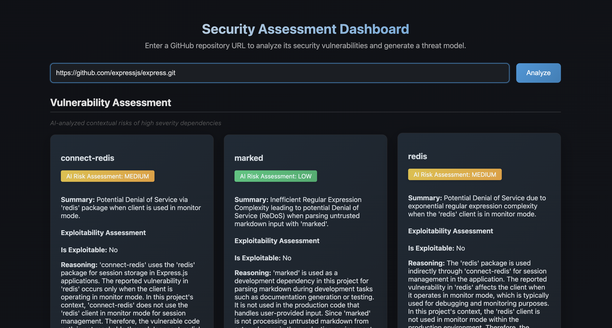

# LLM-powered Vulnerability Risk Agent

A web-based tool that performs security analysis on Nodejs repositories, providing threat modeling and vulnerability assessments with AI-powered risk evaluation.



## Features

- Triage of false-positives
- Threat modeling
- Interactive dashboard visualization

## Augmented LLM Generation

Augments LLMs with context-specific security metadata and open source intelligence from the GitHub advisories database. 

## Architecture

The application follows a client-server architecture:

### Frontend
- Pure JavaScript web interface
- Marked.js for Markdown rendering
- Dynamic vulnerability card generation
- Risk level visualization

### Backend
- REST API endpoint (`/analyze`)
- GitHub repository processing
- Vulnerability scanning
- AI-enhanced risk assessment

## Getting Started

1. Clone the repository
2. Add your GitHub and OpenAI API keys
3. Start the agent server:
   ```bash
   cd agent
   npm install
   npm start
   ```
3. Start the frontend server:
   ```bash
   cd frontend
   npm install
   npm start
   ```
5. Enter a GitHub repository URL and click "Analyze"

## API Endpoints

### POST /analyze
Accepts a GitHub repository URL and returns:
- Threat model (in Markdown format)
- Vulnerability analysis with:
  - Package information
  - Contextual risk levels
  - Exploitability assessment
  - Required conditions
  - Recommended mitigations
